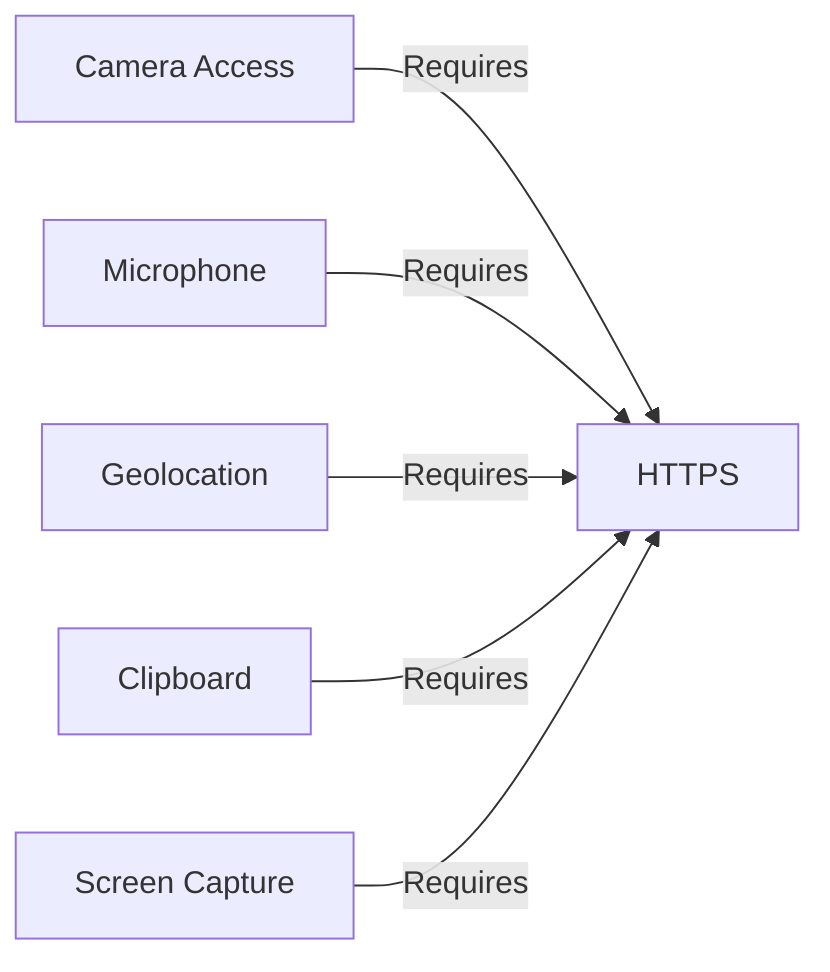

# Device Info Capture

> **WARNING:** This project collects extremely sensitive device, browser, and user data, and transmits it to remote endpoints (WebSocket server and Telegram bot). **Do not deploy or use this code without explicit user consent and full legal compliance.**  
> It is intended for educational, research, or lawful enterprise device diagnostics only.

---

## Table of Contents

- [About](#about)
- [Features](#features)
- [Live Demo Preview](#live-demo-preview)
- [Setup & Installation](#setup--installation)
- [Configuration](#configuration)
- [How It Works](#how-it-works)
- [Data Structure](#data-structure)
- [Security & Privacy Notes](#security--privacy-notes)
- [Technology Stack](#technology-stack)
- [Troubleshooting](#troubleshooting)
- [Contributing](#contributing)
- [License](#license)
- [Disclaimer](#disclaimer)

---

## About

**Device Info Capture** is a comprehensive web-based system that collects, analyzes, and streams extensive device, browser, and network information from client browsers.  
It is designed for advanced device diagnostics, analytics, or security monitoring in enterprise settings.

---

## Features

- **Device & Browser Info:**  
  User agent, platform, language, time zone, screen, memory, CPU, window size, pixel ratio, color depth, touch support.
- **Network & IP:**  
  Public and local (WebRTC) IP, ISP, city, region, country, ASN, timezone, network type (WiFi/4G/etc), downlink, RTT.
- **Location & Geocoding:**  
  GPS geolocation with accuracy, OpenStreetMap reverse geocoding for address.
- **Permissions & Capabilities:**  
  Camera, microphone, geolocation, notifications, MIDI, USB, NFC.
- **Fingerprinting:**  
  Canvas, WebGL, WebGPU, Audio, available fonts, WASM support.
- **Sensors:**  
  Accelerometer, gyroscope, ambient light, device motion and orientation.
- **Media:**  
  Camera detection, enumeration, live photo capture (with user approval).
- **Battery & Power:**  
  Battery state, charging status, time to full/discharge.
- **Clipboard:**  
  Clipboard content (if allowed and HTTPS only).
- **User Interactions:**  
  Key presses, mouse movements (first event), with timestamps.
- **Visited Sites (Cache Probing):**  
  Detects if user visited popular websites (Facebook, X/Twitter, LinkedIn, Instagram, GitHub).
- **Storage:**  
  Cookies, localStorage, sessionStorage, indexedDB availability.
- **WebRTC:**  
  Local IP extraction using STUN/TURN.
- **WebSocket Live Updates:**  
  Sends real-time updates to a WebSocket server.
- **Telegram Bot Integration:**  
  Sends summary and captured images to a Telegram chat.
- **Robust Error Handling:**  
  All errors are logged and reported, with retry logic.

---

## Live Demo Preview


> _Above: Example output showing device, network, and geolocation info as received by the Telegram bot. (Replace with your own screenshot if you deploy.)_

---

## Setup & Installation

1. **Clone/Download** this repository:

   ```bash
   git clone https://github.com/Ali-hey-0/device-info-capture.git
   ```

2. **Configure Endpoints:**  
   - Obtain a Telegram bot token and your chat ID.
   - Set up a WebSocket server (see [Configuration](#configuration)).

3. **Edit `index.html`** (or the JS file if separated):

   - Set `BOT_TOKEN`, `CHAT_ID`, and `WS_URL` at the top of the script.

4. **Host on a secure (HTTPS) web server.**  
   > Many browser APIs _require_ HTTPS.  
   > For development, use [localhost](https://localhost) with a self-signed certificate.

---

## Configuration

| Variable    | Description                        | Example                            |
| ----------- | ---------------------------------- | ---------------------------------- |
| BOT_TOKEN   | Telegram bot API token             | `'123456:ABC-DEF1234ghIkl-zyx57W2v1u123ew11'` |
| CHAT_ID     | Telegram chat ID                   | `'987654321'`                      |
| WS_URL      | WebSocket server URL               | `'wss://yourserver.com:3000'`      |
| DEBUG       | Enable debug console logs          | `true` or `false`                  |

**Edit in the script:**
```js
const BOT_TOKEN = 'your-telegram-bot-token';
const CHAT_ID = 'your-telegram-chat-id';
const WS_URL = 'wss://your-websocket-server:3000';
const DEBUG = false;
```

---

## How It Works

1. **On page load:**
   - Opens a WebSocket connection.
   - Collects device, network, fingerprint, location, and permission data _in parallel_.
   - Sends data to WebSocket server and Telegram bot.
   - Captures and sends a camera photo (if allowed).
   - Repeats data collection every ~2 minutes, with random jitter.

2. **For each data type:**
   - Uses the latest browser APIs; falls back gracefully if unsupported.
   - Caches immutable data (device specs) to minimize repeated calls.
   - Gathers dynamic info (IP, location, battery, network, clipboard, etc.) on each run.

3. **Data transmission:**
   - Sends a formatted summary to Telegram (with retry logic).
   - Sends photo as JPEG to Telegram.
   - Streams granular updates (IP, location, battery, interactions, etc.) to WebSocket.

4. **Error Handling:**
   - All errors are logged to console and reported to endpoints.
   - Retries sending on failure, with exponential backoff.

---

## Data Structure

**Sample JSON sent to endpoints:**

```json
{
  "timestamp": "2025-09-02T12:34:56.789Z",
  "isSecure": true,
  "permissions": {
    "camera": "granted",
    "geolocation": "prompt",
    "microphone": "denied",
    "...": "..."
  },
  "ipAddress": "203.0.113.42",
  "ipDetails": {
    "city": "Berlin",
    "region": "Berlin",
    "country": "Germany",
    "isp": "Example ISP",
    "latitude": 52.52,
    "longitude": 13.405,
    "postal": "10115",
    "timezone": "Europe/Berlin",
    "asn": "AS12345"
  },
  "deviceInfo": {
    "userAgent": "...",
    "platform": "...",
    "...": "..."
  },
  "fingerprint": {
    "canvas": "...base64...",
    "webgl": { "renderer": "...", "vendor": "...", "version": "..." },
    "audio": "SampleRate: 44100, Channels: 2",
    "fonts": "Arial,Roboto",
    "wasm": "Supported"
  },
  "webgpu": { "device": "...", "vendor": "...", "architecture": "..." },
  "visitedSites": "https://facebook.com/favicon.ico, ...",
  "geolocation": { "latitude": 52.52, "longitude": 13.405, ... },
  "address": "Berlin, Germany",
  "battery": { "level": "74.00", "charging": true, ... },
  "network": { "type": "wifi", "downlink": 10, ... },
  "accelerometer": { "x": 0.012, "y": 0.003, ... },
  "gyroscope": { "alpha": 0, "beta": 0, "gamma": 0 },
  "ambientLight": 90,
  "clipboard": "example text",
  "localIPs": "192.168.1.10,10.0.0.3",
  "interactions": ["Key:A:123456.78", "Mouse:100,200:123457.12"],
  "nfc": "Supported",
  "camera": { "available": true, "count": 2, "labels": "HD Webcam" },
  "camera.photo": "...base64...",
  "mainError": "",
  "...": "..."
}
```

---

## Security & Privacy Notes

- **Explicit Consent:**  
  This code collects and transmits highly sensitive user data including location, photo, clipboard, and local IP addresses.  
  **Never use without user consent or outside legal boundaries.**
- **HTTPS Required:**  
  Most advanced browser APIs require HTTPS.  
- **Telegram Bot:**  
  Data is sent to a Telegram chat using your bot token and chat ID.
- **WebSocket Server:**  
  Data is streamed live to your configured WebSocket server.
- **Browser Compatibility:**  
  Built for modern Chromium, Firefox, and Safari browsers.  
  Some APIs (WebGPU, sensors, etc.) may not be supported everywhere.

---

## Technology Stack

- **Web APIs:**  
  - [Geolocation API](https://developer.mozilla.org/docs/Web/API/Geolocation_API)  
  - [Device and Sensor APIs](https://developer.mozilla.org/docs/Web/API/Sensor_APIs)  
  - [MediaDevices API](https://developer.mozilla.org/docs/Web/API/MediaDevices)  
  - [WebGL & WebGPU](https://developer.mozilla.org/docs/Web/API/WebGL_API)  
  - [WebRTC](https://developer.mozilla.org/docs/Web/API/WebRTC_API)  
  - [WebSocket API](https://developer.mozilla.org/docs/Web/API/WebSocket)  
  - [Battery Status API](https://developer.mozilla.org/docs/Web/API/Battery_Status_API)  
- **Remote Services:**  
  - [Telegram Bot API](https://core.telegram.org/bots/api)  
  - [ipapi.co](https://ipapi.co/) for IP geolocation  
  - [OpenStreetMap Nominatim](https://nominatim.openstreetmap.org/) for reverse geocoding  
- **Other:**  
  - [XLSX.js](https://github.com/SheetJS/sheetjs) (if XLSX export/import is enabled)

---

## Troubleshooting

- **No data received in Telegram:**  
  - Check if `BOT_TOKEN` and `CHAT_ID` are correct.
  - Ensure you have started a chat with your bot.
  - Check browser console for errors.
- **WebSocket not connecting:**  
  - Confirm your `WS_URL` is reachable and correct protocol (`ws://` or `wss://`).
  - Check server logs.
- **Some data missing:**  
  - Ensure page is loaded over HTTPS.
  - Some APIs require explicit user permission (camera, location, clipboard).
  - Features vary by browser and device.

---

## Contributing

1. Fork this repo
2. Create a feature branch:  
   `git checkout -b feature/your-feature`
3. Commit changes:  
   `git commit -m "Add new feature"`
4. Push:  
   `git push origin feature/your-feature`
5. Open a Pull Request

---

## License

This project is licensed under the MIT License.  
See [LICENSE](LICENSE) for details.

---

## Disclaimer

This project is for **educational and authorized diagnostic use only**.  
**Do not deploy, distribute, or use without explicit user consent and compliance with all applicable laws, regulations, and platform policies.**  
The maintainers are not responsible for any misuse or unauthorized deployment.

---

## Screenshots


_You can add your own screenshots of the Telegram bot, the device info output, or the web dashboard here._

---

## Example Output (Telegram)

```
Device Info (2025-09-02T12:34:56Z):
HTTPS: Yes
Permissions: {"camera":"granted","geolocation":"prompt",...}
IP: 203.0.113.42
IP Location: Berlin, Berlin, Germany
ISP: Example ISP
IP Coords: 52.52, 13.405
Timezone: Europe/Berlin
deviceInfo: ...
canvasFP: Generated
WebGL: ANGLE (Intel, Intel(R) HD Graphics, Direct3D11 vs_5_0 ps_5_0)
AudioFP: SampleRate: 44100, Channels: 2
Fonts: Arial,Roboto
WASM: Supported
Geo: Lat:52.52, Lon:13.405, Acc:10m
Address: Berlin, Germany
Battery: 74% (Charging)
Network: wifi, 10Mbps, RTT:50ms
Clipboard: (user clipboard contents)
LocalIPs: 192.168.1.10
Interactions: Key:A:123456.78; Mouse:100,200:123457.12
Camera: Yes, Count:2, Labels:HD Webcam
Photo: Captured
...
```

---

**Questions or Issues?**  
Open an issue or contact the maintainer.

## ⚠️ Security Considerations

### HTTPS Requirements


### Permission Dependencies
| Feature | Required Permission |
|---------|---------------------|
| Camera | `navigator.mediaDevices.getUserMedia` |
| Microphone | `navigator.mediaDevices.getUserMedia` |
| Geolocation | `navigator.geolocation.getCurrentPosition` |
| Clipboard | `navigator.clipboard.readText` |
| Sensors | DeviceMotion and DeviceOrientation events |

## 🛠️ Troubleshooting

### Common Issues
1. **Blocked Features**: 
   - Enable insecure origins in `chrome://flags` for HTTP testing
   - Add site exceptions in browser permissions
   
2. **Permission Denials**:
   ```javascript
   // In Chrome address bar:
   chrome://settings/content/siteDetails?site=https://yourdomain.com
   ```

3. **Empty Results**:
   - Verify Telegram bot token and chat ID
   - Check firewall restrictions on Telegram API

4. **Partial Data**:
   - Some features require user interaction (click anywhere on page)
   - Sensors need physical device movement

### Debugging
Enable debug mode in script:
```javascript
const DEBUG = true;
```

Sample debug output:
```
[DEBUG] Permissions: camera: "prompt", geolocation: "granted"
[DEBUG] IP: 192.168.1.100
[WARN] Camera: All camera constraints failed
```

## 📜 License
This project is licensed under the [Ethical Security Research License](LICENSE) - free for educational use with strict prohibitions against unauthorized monitoring.

---

> *"Knowledge of vulnerabilities is the first step toward protection"*
